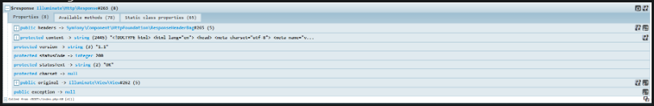

# php-profiler-examples - Kint

## Enabling Kint
Kint is already enabled in this project - it is placed under `piblic/index.php` which will dump out details of the entirety of the response. This is simply done as:

```php
d($response);
```

A UI bar will appear that can be clicked through for further call details.

## Installation 
If installation is needed for other projects, read below.

Kint is a debugger that has a UI in the same form of what Laravel Debug Bar and PHP Debug Bar has.

Documentation for Kint can be found [here](https://kint-php.github.io/kint/).

### Installation
With `composer` on your local environment, run the following:

```
composer require kint-php/kint
```
> **NOTE**: If a `composer.json` file doesn't exist yet, create one first and add an empty object into the file - ex. `{}`

This will create a `vendor` folder. Depending on your project, you need to do one of the following:
- If using plain PHP, require the `vendor` folder with `autoload` - `include 'vendor/autoload.php';`
- If using a framework, it most likely is already including the `vendor` folder into the project.

Next, use the following, either at an application entry point of a point of possible slowness:

```
d($response);
```

In this case, this was used in Laravel's `public/index.php` file - since this is where responses are sent from. The syntax and usage for Kint is simple enough that all it requires is the `d()` function, which is a shorthand for Kint usage. `d()` requires one (1) argument, which is what is being dumped.

`d()` will automatically be in scope and available if imported/installed.

The following UI will be shown if succesful:


This includes the entirety of the response and more, from a deeper application standpoint - showing all functions that may have been invoked or used. Each property and available methods can be looked into. This also shows the location of where `d()` was invoked from.
