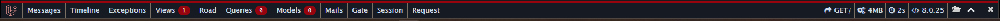
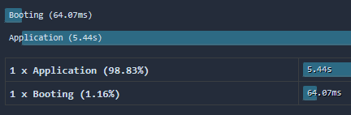

# Laravel Debug Bar
This is a package specific to Laravel - based off of PHP Debug Bar - it is a profiler and general debug tool designed to help catch slow performance and/or general errors and exceptions

[GitHub repo](https://github.com/barryvdh/laravel-debugbar)

### How to enable
- Install the package via composer with `composer require barryvdh/laravel-debugbar --dev`
- Set the environment variable/App Setting `APP_DEBUG` to `true`

> **NOTE**: If `APP_DEBUG` is false, the bar will not show, by design.

When enabled, the bar will show at the bottom of the page and look like the following:

- **Timeline**: The request duration and breakdown. With a breakdown on how much of this was application time:

- **Messages**: Any messages (like console messages) written while invoking the route.
- **Exceptions**: Any exceptions thrown during the handling of the request
- **Views**: Views rendered for the route accessed, as well as view information - such as view path in Laravel.
- **Route**: Various route information, such as the controller and method in the controller invoking the request, namespace, prefixes (if applicable), route 'name' (if applicable) and file the Controller lives in.
- **Queries**: If any queries were executed on the route
- **Models**: Models used on the route
- **Session**: Information on active sessions
- **Request**: Various request information - such as status code, status text, format, content type, request headers and server environment variables, request cookies, etc.

Current route, memory usage, request duration and PHP version are also some of the options shown.