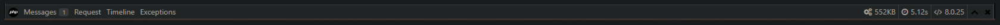

# PHP Debug Bar
PHP Debug bar is a debug and profiling tool that can help catch slow performance and/or general errors and exceptions. When enabled, this shows up at the bottom of the browser page and as expandable bar.

By default, this comes pre-configured with the Messages, Request, Timeline and Exception tab. As well as showing additional information such as memory usage for the page being hit, request duration and PHP version.

- **Messages:** Any messages (like console messages) written while invoking the route.
- **Request:** Shows various information on the request, as well as information on these PHP variables - $_GET, $_POST, $_COOKIE, $_SERVER. For instance, $_SERVER will show various server side environment variables in an array.
- **Timeline:** This will show the time taken between two points of interest within the codebase. This will can be set by start or stop functions.
- **Exceptions:** This will display any exceptions or errors for the page/route invoked.

Documentation for PHP Debug Bar can be found [here](http://phpdebugbar.com/docs/readme.html#installation).